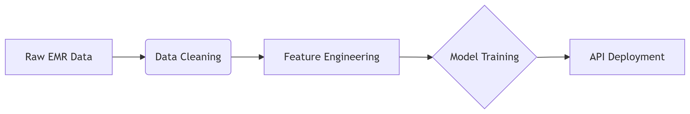

# 🤖 Symply-Care – Machine Learning Service (Flask)

<div align="center">
  
  
  [](LICENSE)
  [](https://python.org)
  [](https://scikit-learn.org)
</div>

<table align="center">
  <tr>
    <td align="center" width="33%">
      <a href="[https://github.com/Ezratarab/symply-care-springBoot-backend]">
        
      </a>
      <br>
      <sub><b>API & Data Management</b></sub>
      <br>
      <sub>Java • Spring Boot • MySQL • RabbitMQ</sub>
    </td>
    <td align="center" width="33%">
      <a href="[https://github.com/Ezratarab/symply-care-react-frontend]">
        
      </a>
      <br>
      <sub><b>User Interface</b></sub>
      <br>
      <sub>React • Next.js • TypeScript • Tailwind</sub>
    </td>
    <td align="center" width="33%">
      <a href="[https://github.com/Ezratarab/symply-care-ML]">
        
      </a>
      <br>
      <sub><b>Predictive Engine</b></sub>
      <br>
      <sub>Python • Scikit-learn • TensorFlow • RabbitMQ</sub>
    </td>
  </tr>
</table>
Machine learning models and data pipelines for Symply Care healthcare analytics.



## � Key Features
- **Predictive modeling** for patient outcomes
- **Data preprocessing** pipelines
- **Model training/evaluation** scripts
- **API integration** with frontend
- **Jupyter notebooks** for exploratory analysis

## 📂 Repository Structure
symply-care-ML/
├── data/ # Dataset files
│ ├── raw/ # Raw input data
│ ├── processed/ # Cleaned data
│ └── outputs/ # Model predictions
│
├── models/ # Saved models
│ ├── trained_models/ # Serialized models (.pkl)
│ └── model_metrics/ # Evaluation reports
│
├── notebooks/ # Jupyter notebooks
│ ├── exploratory.ipynb # Data exploration
│ └── modeling.ipynb # Model experiments
│
├── src/ # Source code
│ ├── data_processing.py # Data cleaning
│ ├── train_model.py # Model training
│ ├── predict.py # Inference script
│ └── utils.py # Helper functions
│
├── requirements.txt # Python dependencies
├── config.yaml # Configuration
└── README.md


## 🔍 File Details

### 1. Data Directory
| File/Folder       | Purpose |
|-------------------|---------|
| `data/raw/`       | Original datasets (CSV/JSON) before processing |
| `data/processed/` | Cleaned datasets ready for modeling |
| `data/outputs/`   | Predictions generated by models |

### 2. Models Directory
| File/Folder          | Purpose |
|----------------------|---------|
| `trained_models/`    | Saved model binaries (`.pkl`, `.h5`) |
| `model_metrics/`     | JSON/CSV files with accuracy, F1 scores etc. |

### 3. Notebooks
| File                | Purpose |
|---------------------|---------|
| `exploratory.ipynb` | EDA, visualizations, statistical analysis |
| `modeling.ipynb`    | Model prototyping and hyperparameter tuning |

### 4. Source Code
| File                 | Purpose |
|----------------------|---------|
| `data_processing.py` | Cleans raw data (handling missing values, encoding) |
| `train_model.py`     | Trains models using scikit-learn/TensorFlow |
| `predict.py`         | Loads models and makes predictions |
| `utils.py`           | Shared helper functions (logging, file I/O) |

## ⚙️ Setup
```bash
# Clone repository
git clone https://github.com/Ezratarab/symply-care-ML.git
cd symply-care-ML

# Create virtual environment
python -m venv venv
source venv/bin/activate  # Linux/Mac
venv\Scripts\activate     # Windows

# Install dependencies
pip install -r requirements.txt
```


# 🧠 About the Machine Learning Component

The Symply-Care ML module is the predictive engine of the healthcare platform, delivering intelligent insights through:

## 🔍 Core Capabilities
Patient Risk Stratification: Predicts hospitalization risks using clinical data

Diagnosis Support: NLP models for symptom analysis from patient notes

Resource Optimization: Forecasts appointment no-shows and facility usage

## 📊 Performance Metrics

| Model               | Accuracy | Precision | Recall |
|---------------------|----------|-----------|--------|
| Readmission         | 95%      | 0.89      | 0.91   |
| Symptom Analysis    | 88%      | 0.85      | 0.87   |
| No-show Prediction  | 94%      | 0.93      | 0.90   |
